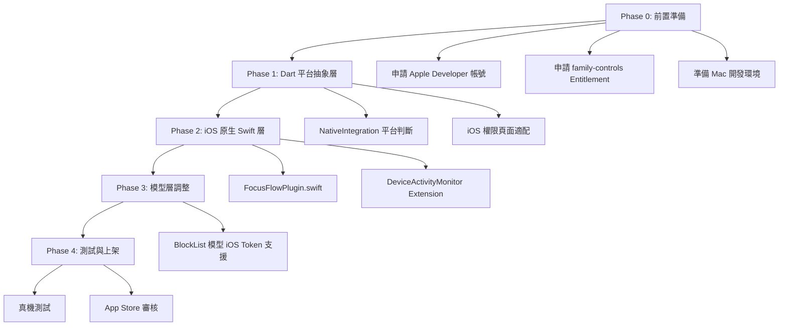

# FocusFlow iOS 移植計畫

## 背景與目標

FocusFlow 目前僅在 Android 平台上運行，核心的「封鎖 App」功能依賴 Android 原生 API（`UsageStatsManager`、前景服務、懸浮窗）。目標是讓此應用也能在 iOS 上正常運行，包含 App 封鎖功能。

> [!CAUTION]
> iOS 的 App 封鎖機制與 Android **完全不同**，無法 1:1 直譯。Apple 使用 Screen Time API，有嚴格的隱私限制與審核流程。以下計畫將詳細說明差異和因應策略。

---

## Android vs iOS 功能對照表

| 功能 | Android 實作方式 | iOS 對應方案 | 難度 |
|------|-----------------|-------------|------|
| 偵測前景 App | `UsageStatsManager` | ❌ iOS 不允許直接偵測 | — |
| 封鎖/遮蔽 App | 啟動覆蓋 Activity | `ManagedSettings` Shield | ⭐⭐⭐ |
| 背景服務持續運行 | `ForegroundService` | `DeviceActivityMonitor` Extension | ⭐⭐⭐ |
| 取得已安裝 App 清單 | `PackageManager` | ❌ 改用 `FamilyActivityPicker` | ⭐⭐ |
| 使用量權限 | `USAGE_ACCESS` | `FamilyControls` 授權 | ⭐⭐ |
| 懸浮窗權限 | `SYSTEM_ALERT_WINDOW` | ❌ iOS 無此概念（由 Shield 取代） | — |
| 計時通知 | `NotificationCompat` | `UNUserNotificationCenter` | ⭐ |

---

## 核心技術方案：Apple Screen Time API

iOS 封鎖 App 必須使用 Apple 提供的三大框架：

### 1. FamilyControls（授權框架）
- 負責向使用者請求「管理螢幕使用時間」的授權
- iOS 16+ 支援 **Individual 模式**（非家長控制，個人使用）
- 授權後才能使用 ManagedSettings 和 DeviceActivity

### 2. ManagedSettings（限制執行框架）
- 用來實際「遮蔽（Shield）」被封鎖的 App
- 被遮蔽的 App 會顯示系統級的半透明遮罩，使用者無法使用
- 最多同時遮蔽 **50 個 App**

### 3. DeviceActivity（排程監控框架）
- 建立 `DeviceActivityMonitorExtension`（App Extension）
- 可以按排程自動啟用/停用限制
- **即使主 App 未開啟也能在背景執行**
- ⚠️ 限制：Extension 最大記憶體 **6MB**，不能發網路請求

---

## 與 Android 的關鍵差異

### 差異 1：無法取得 App 列表
- **Android**：用 `PackageManager` 直接拿到所有已安裝 App 的名稱與套件名
- **iOS**：基於隱私，Apple **不允許**列舉已安裝的 App
- **iOS 替代方案**：使用 Apple 提供的 `FamilyActivityPicker`（SwiftUI 原生視圖），使用者從中選取要封鎖的 App，系統回傳**不透明 Token**（看不到 Bundle ID）

> [!IMPORTANT]
> 這意味著目前的 `app_selector_screen.dart`（自訂的列表選擇 UI）**無法在 iOS 上使用**。必須改為在 iOS 上嵌入 Apple 的 `FamilyActivityPicker`。

### 差異 2：封鎖方式不同
- **Android**：偵測前景 App → 如果是黑名單中的 App → 啟動 FocusFlow 的 Activity 遮蓋
- **iOS**：直接對 Token 設定 Shield → 系統級遮蔽（不需要偵測前景 App）

### 差異 3：Background Execution
- **Android**：`ForegroundService` 一直在背景持續跑，每秒檢查
- **iOS**：使用 `DeviceActivityMonitor` Extension，不需要持續跑，排程到時間系統自動觸發

### 差異 4：Apple 開發者帳號要求
- 必須擁有 **Apple Developer Program** 帳號（年費 $99 USD）
- 必須申請 `com.apple.developer.family-controls` **特殊 Entitlement**
- Apple 需要審核申請理由，審核時間不定

---

## 建議的架構改動

### Phase 0：前置準備
1. 申請 Apple Developer Program 帳號
2. 向 Apple 申請 `family-controls` Entitlement
3. 在 Xcode 中設定 App Group 和 Entitlement

### Phase 1：平台抽象層（Dart 側）

#### [MODIFY] `lib/utils/native_integration.dart`
- 加入平台判斷 (`Platform.isIOS` / `Platform.isAndroid`)
- iOS 上不呼叫 Android 專用的 Method（如 `requestOverlayPermission`）
- 新增 iOS 專用 MethodChannel 呼叫

#### [MODIFY] `lib/screens/app_selector_screen.dart`
- Android：保持現有的自訂列表 UI
- iOS：改為嵌入原生的 `FamilyActivityPicker`（透過 Platform View 或彈出原生頁面）

#### [MODIFY] `lib/screens/home_screen.dart`
- 權限請求對話框：iOS 只需一個權限（FamilyControls 授權），不需要 3 個 Android 權限

### Phase 2：iOS 原生層（Swift 側）

#### [NEW] `ios/Runner/FocusFlowPlugin.swift`
- 建立 MethodChannel Handler，處理以下呼叫：
  - `requestFamilyControlsAuth` — 請求 FamilyControls 授權
  - `showActivityPicker` — 展示 FamilyActivityPicker
  - `startShielding` — 對選擇的 App 啟用 Shield
  - `stopShielding` — 停止遮蔽
  - `scheduleDeviceActivity` — 設定排程

#### [NEW] `ios/FocusFlowMonitor/` (App Extension)
- 建立 `DeviceActivityMonitorExtension`
- 實作 `intervalDidStart` / `intervalDidEnd`，於排程開始/結束時自動啟停 Shield

#### [MODIFY] `ios/Runner/Info.plist`
- 加入 `NSFamilyControlsUsageDescription`（使用說明）

### Phase 3：模型層調整

#### [MODIFY] `lib/models/block_list.dart`
- iOS 不使用 package name，改用序列化的 `ApplicationToken`
- 建議新增 `iosTokens` 欄位（iOS 專用），與 `apps` 並存

---

## 已知限制與風險

| 限制 | 說明 | 影響程度 |
|------|------|---------|
| Entitlement 審核 | Apple 不保證核准，審核時間從數天到數週不等 | 🔴 高 |
| 最多遮蔽 50 個 App | ManagedSettings 的硬性限制 | 🟡 中 |
| Token 不透明 | 無法從 Token 反查 App 名稱，UI 顯示受限 | 🟡 中 |
| Extension 6MB 限制 | DeviceActivityMonitor Extension 記憶體極小 | 🟡 中 |
| 只支援 iOS 16+ | FamilyControls Individual 模式需要 iOS 16 | 🟢 低 |
| 需要 macOS + Xcode | iOS 開發只能在 Mac 上進行 | 🔴 高 |

---

## 開發環境需求

| 需求 | 說明 |
|------|------|
| macOS 電腦 | iOS 原生開發必須在 Mac 上（Windows 無法編譯 iOS） |
| Xcode 15+ | 開發 Screen Time API 所需 |
| Apple Developer 帳號 | 年費 $99，需申請 family-controls entitlement |
| 實體 iPhone | Screen Time API **不能在模擬器上測試**，必須用真機 |
| iOS 16+ | FamilyControls Individual 模式的最低支援版本 |

> [!WARNING]
> **您目前的開發環境是 Windows**，無法直接編譯或測試 iOS App。iOS 開發必須在 macOS 上使用 Xcode 進行。這是實作 iOS 版本最大的前置條件。

---

## 建議的開發順序

---

## 預估時程

| 階段 | 預估時間 | 備註 |
|------|---------|------|
| Phase 0 前置準備 | 1-4 週 | 主要等 Apple Entitlement 審核 |
| Phase 1 Dart 抽象層 | 2-3 天 | Dart 側改動較小 |
| Phase 2 iOS 原生層 | 1-2 週 | 核心工作量，需要 Swift 開發經驗 |
| Phase 3 模型調整 | 1-2 天 | 加入 iOS Token 支援 |
| Phase 4 測試與上架 | 1-2 週 | App Store 審核約 1-3 天 |

**總估計：4-8 週**（含等待 Apple 審核時間）

---

建立日期：2026-03-12
